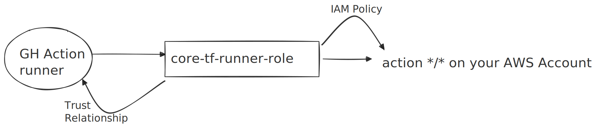
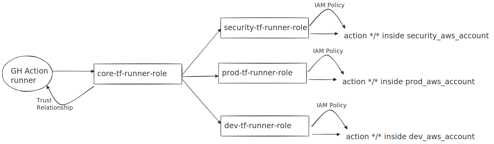

This blog is part 2 of the series of articles. In the last blog we saw the benefits of running Terraform on CI. The following will get into the details of how to setup Terraform. Let's zoom into what kind of challenges one can face while setting up Terraform run on CI.

Typically Terraform is used to manage infrastucture in Cloud. It can use native provider such as [AWS Provider](https://registry.terraform.io/providers/hashicorp/aws/latest/docs). Terraform can also use other tools to carry out different automation tasks such as [Helm](https://registry.terraform.io/providers/hashicorp/helm/latest/docs) to install manage resources in Kubernetes cluster, [Ansible](https://registry.terraform.io/modules/cloudposse/ansible/null/latest) for VM Orchestration. You may rquire all or some or more providers depending on your infrastructure. Each provider has it's own setup caveats. We will cover some of these caveats.

### Terraform Version

Let's start right with Terraform version itself. Locking a Terraform version and standardizing it for everyone is a crucial step to avoid provider version vesion conflict issues.

It's absolutely necessary to lock the terraform version for everyone to avoid issues. Terraform version changes can affect the modules. If the state file was created in some other version than the decided locked version, one may face some issues with state file.

From the docs:

> In general, Terraform will continue to work with a given state file across minor version updates. For major or minor releases, Terraform will update the state file version if required, and give an error if you attempt to run an older version of Terraform using an unsupported state file version.

State file issue are more nasty to deal that other minor issues, such as some backend flag deprecated: [Example](https://developer.hashicorp.com/terraform/language/upgrade-guides#s3-backend-authentication-changes). Such issues need to be dealt on a case-by-case basis. If you are be able to run `terraform init` in all modules without any error, it means you have chosen the right version for the current IaC codebase.

### Cloud provider access

Terraform will need to talk to the cloud providers via CI. This means the right authentication mechanisms need to be in place for the plan and apply to run without any access errors. To understand this in detail - I'll take an example of AWS but the idea remains same for other providers as well. I will take the instance of Github Actions for demonstrating CI examples.

When an Infra admin runs terraform from local machine to make Infra changes, they typically use their personal identity(AWS SSO Profile for example) to authenticate with AWS. AWS Terraform provider can get auth configuration from [several](https://registry.terraform.io/providers/hashicorp/aws/latest/docs#authentication-and-configuration) sources with a pre-defined priority order. We can use any of the listed auth mechanism to authenticate terraform on CI as well.

**Setup**

First setup is creating AWS Dir in CI (`~/.aws`) and an AWS config file that can be used by [TF AWS Provider](https://registry.terraform.io/providers/hashicorp/aws/latest/docs). Inside this file, we should mention a role that have access to create/destroy/change all kind of infra in your AWS account.

This is how the role policy should look like:

```json
{
  "Statement": [
    {
      "Action": "*",
      "Effect": "Allow",
      "Resource": "*",
      "Sid": ""
    }
  ],
  "Version": "2012-10-17"
}
```

You can see we have given `*/*` permissions to this role. But we can restrict access by allowing selective actions on selected resources as well for better control on infra and cost.
Let's call this IAM role `core-tf-runner-role`.

Now we just to assume this role in CI to provision infrastructure in our AWS account. For that we will need to allow the Github Runners to assume this role. We can achieve that via a trust relationship like:

```json
{
  "Version": "2012-10-17",
  "Statement": [
    {
      "Sid": "",
      "Effect": "Allow",
      "Principal": {
        "Federated": "arn:aws:iam::ACCNT_ID:oidc-provider/token.actions.githubusercontent.com"
      },
      "Action": "sts:AssumeRoleWithWebIdentity",
      "Condition": {
        "StringEquals": {
          "token.actions.githubusercontent.com:aud": "https://github.com/orgName/repoName"
        },
        "StringLike": {
          "token.actions.githubusercontent.com:sub": "repo:orgName/repoName:*"
        }
      }
    }
  ]
}
```

The repo in the `sub` refers to the Github repo where we are setting up CI action. The following diagram is conceptual representation of various entities involved/



On CI, we need to create/produce a config file in the below format to give the CI an AWS identity. The AWS Profile should assume the role we created above.

Example Config file:

```sh
[profile core_aws_account]
role_arn = arn:aws:iam::dev-acnt-id:role/core-tf-runner-role
credential_source = Environment
region = us-west-1
```

This file should be present in CI. We have multiple ways to do this: e.g Pre-Baked in the CI image or imported as github action step or shell magic etc etc. For sake of simplicity, I'm assuming the file is being loaded from a script. Here is a demonstrative Github Actions codeblock describing the approach.

```yaml
- name: create aws directory and a config file
  run: mkdir ~/.aws && touch ~/.aws/config

- name: Render AWS configs
  run: |
    <<your script to load the Config file inside ~/.aws/config

- name: Setup terraform
  uses: hashicorp/setup-terraform@v3
  with:
    terraform_version: '1.6.0' # locking the version
```

With this setup ready, we can run terraform commands inside terraform modules.
Example terraform module which uses the AWS profile we just setup. Here the state file is in the same AWS account where we are creating other infrastructure resources.

```hcl
//terraform.tf
terraform {
  required_version = "~> 1.6.0"

  required_providers {
    aws = {
      source  = "hashicorp/aws"
      version = "~> 4.59.0"
    }
  }

  backend "s3" {
    bucket              = "<<bucket-name>>"
    key                 = "<<state path>>"
    region              = "us-west-1"
    profile             = "core_aws_account"   //access provided via ~/.aws/config file
    use_legacy_workflow = false
  }
}

//provider.tf
provider "aws" {
  region  = var.region
  profile = "core_aws_account"
}

//main.tf
resource "aws_s3_bucket" "example" {
  bucket = "my-tf-test-bucket"

  tags = {
    Name        = "My bucket"
    Environment = "Dev"
  }
}
```

**Multi AWS Account setup**

If you have multiple AWS accounts connectivity requirement in different modules, it's best to create one tf-runner role per AWS account for better control and management. e.g prod-tf-runner-role, security-tf-runner-role, dev-tf-runner-role. So, the config file expands correspondingly.

```sh
[profile dev_aws_account]
role_arn = arn:aws:iam::dev-acnt-id:role/dev-tf-runner-role
credential_source = Environment
region = us-west-1

[profile prod_aws_account]
role_arn = arn:aws:iam::prod-acnt-id:role/prod-tf-runner-role
credential_source = Environment
region = us-west-1

[profile security_aws_account]
role_arn = arn:aws:iam::prod-acnt-id:role/security-tf-runner-role
credential_source = Environment
region = us-west-1
```

We can establish the same trust relationship with Github in each role. But that can be tedious to manage. We can "DRY" it further by creating an intermediate role which can assume all these runner roles and can be assumed by Github. I'll call this intermediate role "core-tf-runner-role" here.

Conceptually:



In order to achieve this flow, we will need to add a trust relationship between `core-tf-runner-role` and other runner roles.

```json
// create this trust relationship with all account runner roles
{
  "Version": "2012-10-17",
  "Statement": [
    {
      "Sid": "",
      "Effect": "Allow",
      "Principal": {
        "AWS": "arn:aws:iam::ACCNT_ID:role/core-tf-runner-role"
      },
      "Action": "sts:AssumeRole"
    }
  ]
}
```
