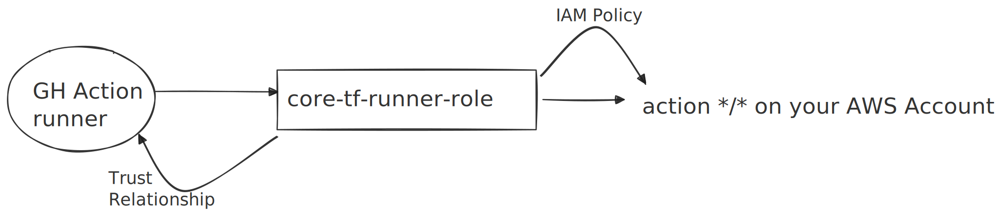

We at Pixxel heavily and only use [Terraform](https://www.terraform.io/) to create, change and destroy infrastructure. Terraform allows you to declare infrastructure as code in a language called HCL. Once you have expressed your IaC in code, you can commit to a version control. You can get it reviewed, roll it back etc. It simply allows to move fast following the similar principles as Software engineering including clean code practices. The following will go into a basic introduction of terraform and how we use Terraform to democratize infrastructure at Pixxel.

### Typical Terraform Workflow

Terraform allows you to dry run your changes before actually applying them called "plan". The plan is a human readable diff of the changes. Terraform stores the current infrastructure state in a file, rightly called "state file" denoted with `.tfstate` extension. Whenever you run plan, the diff of current code and state file is shown. When you accept the diff, and apply it, terraform perform the appropriate changes to update the infra and the state file is updated subsequently. The code and state remains in-sync.

To run terraform collaboratively, a team of SRE/devops engineers may choose to share the same state file to everyone in the team - by putting it in a shared bucket e.g. S3 bucket. This way, multiple people making changes to infra will not accidentally overwrite each other. As soon as someone runs a plan/apply action, terraform acquires a lock on the state file. When others try to access state they will see an error.

### Going one step beyond

Even with a collaborative workflow, the responsibility of making infra changes relies solely on the Devops/SRE team members individually. Most of the times the infra changes requested by teams are ops in nature such as such as giving access, removing access, increasing disk sizes, creating ssh user etc. Such "ops" tasks can be easily automated so that Infra engineers need not run such changes locally. The issue with local runs is local environment can break very easily. By software version mismatch, corrupted config file, cloud service provider access issue etc. This can result in more delay in resolving ops requests and lead to X-Y problem scenarios. This can also cause ops fatigue if not dealt properly. Moreover, you may want to get the plan reviewed with some teammate in case you are unsure about some parts of the plan.
Introducing a new member to the team increases the problem many folds. A teammate will have to teach all the "tips" and "tricks" of running Terraform personally to the new member--this problem is more common than it may appear to an outsider.

The simplest solution is to run terraform on a CI job just like any other software engineering tasks that needs to run in an automated way.

The workflow stated above changes in the following way:

1. You make the required code changes to the relevant terraform modules.
2. You raise a PR with such changes
3. The CI detected the changed modules again main branch.
4. The CI runs terraform plan on these modules using the same shared state file as stated above.
5. The plan can be reviewed by other team members.
6. If it looks good, the PR can be merged.
7. Once the changes are in main branch, the plan can be applied.

There are several benefits of this approach. The setup of terraform and other installations works reliably. The CI can carry out the tasks in a repeated fashion without drift of configs. It is collaborative as the logs are visible to people inside your org. The changes can be reviewed, challenged, revised etc. Moreover, you can rollback reliably.

### Solving what truly matters

Let's be honest, solving the same problem everyday is boring and soon becomes frustrating. If it can't be avoided best automate it. Terraform automation achieves just that. Once you have terraform running on CI, you can ask dev teams to raise PRs -- for the ops changes. You can point them to how it's done from similar ops changes done in past. Of-course this claim that developers will raise Infra PR depends heavily on the engineering culture of the org. At Pixxel, we believe Reliability is a shared responsibility. That makes a strong case for democratizing Infrastructure, enabling everyone to be able to view and manage infrastructure.

Putting Terraform on CI has reduced the interrupts on Cloud team here @ Pixxel. We are able to dedicate time to solving what truly matters.

### Setup drill down

With the intent established, let's zoom into what kind of challenges one can face in setup issue.

#### Terraform Version

It's absolutely necessary to lock on the terraform version for everyone. CI can serve as the source of truth for this. Terraform version changes can affect the modules.

If the state file was created in some other version than the decided locked version, one may face some issues with state file.

From the docs:

> In general, Terraform will continue to work with a given state file across minor version updates. For major or minor releases, Terraform will update the state file version if required, and give an error if you attempt to run an older version of Terraform using an unsupported state file version.

State file issue are more nasty to deal that other minor issues, such as some backend flag deprecated. [Example](https://developer.hashicorp.com/terraform/language/upgrade-guides#s3-backend-authentication-changes). Such issues need to be dealt on a case-by-case basis. Ideally you should be able to run `terraform init` in all modules without any error with the decided version.

#### Cloud provider access

Terraform will need to talk to our cloud provider via CI. This means the right Authentication mechanisms need to be in place for the plan and apply to run without any access errors. To understand this in detail - I'll take an example of AWS but the idea remains same for other providers as well.

When an Infra admin runs terraform from local machine to make Infra changes, they typically use their personal identity(AWS SSO Profile for example) to authenticate with AWS. AWS Terraform provider can get auth configuration from [several](https://registry.terraform.io/providers/hashicorp/aws/latest/docs#authentication-and-configuration) sources with a pre-defined priority order. We can use any of these listed auth mechanism to authenticate terraform on CI as well.

For AWS, I've found the easiest way is to use SSO with assume role. This is how it went. First setup is creating AWS Dir in CI (`~/.aws`) and an AWS config file that can be used by TF AWS Provider. The role that you want to mention in this config file should ideally should have access to create/destroy/change all kind of infra in your AWS account. We can restrict access by allowing selective actions or selected resources as well for better control on infra and cost. Let's call this IAM role `core-tf-runner-role`.

This is how the role policy should look like:

```json
{
    "Statement": [
        {
            "Action": "*",
            "Effect": "Allow",
            "Resource": "*",
            "Sid": ""
        }
    ],
    "Version": "2012-10-17"
}
```

Now we just need to use this role in CI to provision infrastructure in our AWS account. For that we will need to allow the Github Runners to assume this role. We can achieve that via a trust relationship like:

```json
{
    "Version": "2012-10-17",
    "Statement": [
        {
            "Sid": "",
            "Effect": "Allow",
            "Principal": {
                "Federated": "arn:aws:iam::ACCNT_ID:oidc-provider/token.actions.githubusercontent.com"
            },
            "Action": "sts:AssumeRoleWithWebIdentity",
            "Condition": {
                "StringEquals": {
                    "token.actions.githubusercontent.com:aud": "https://github.com/orgName/repoName"
                },
                "StringLike": {
                    "token.actions.githubusercontent.com:sub": "repo:orgName/repoName:*"
                }
            }
        }
    ]
}
```




Example Config file:

```sh
[profile core_aws_account]
role_arn = arn:aws:iam::dev-acnt-id:role/core-tf-runner-role
credential_source = Environment
region = us-west-1
```

If you have multiple AWS accounts, it's best to create one tf-runner role per AWS account for better namespacing. e.g prod-tf-runner-role, security-tf-runner-role, dev-tf-runner-role. 

Example Config file:

```sh
[profile dev_aws_account]
role_arn = arn:aws:iam::dev-acnt-id:role/dev-tf-runner-role
credential_source = Environment
region = us-west-1

[profile prod_aws_account]
role_arn = arn:aws:iam::prod-acnt-id:role/prod-tf-runner-role
credential_source = Environment
region = us-west-1

[profile security_aws_account]
role_arn = arn:aws:iam::prod-acnt-id:role/security-tf-runner-role
credential_source = Environment
region = us-west-1
```

This file should be present in CI. We have multiple ways to do this: e.g Pre-Baked in the CI image or imported as github action step or shell magic etc etc. For sake of simplicity, I'm assuming the file is being loaded from a script. Here is a relevant Github Actions block describing the approach outlined above.

```yaml
- name: create aws directory and a config file
  run: mkdir ~/.aws && touch ~/.aws/config

- name: Render AWS configs
  run: |
    <<your script to load the Config file inside ~/.aws/config

- name: Setup terraform
  uses: hashicorp/setup-terraform@v3
  with:
    terraform_version: '1.6.0'
```

Example Access:

```hcl
//terraform.tf
terraform {
  required_version = "~> 1.6.0"

  required_providers {
    aws = {
      source  = "hashicorp/aws"
      version = "~> 4.59.0"
    }
  }

  backend "s3" {
    bucket              = "<<bucket-name>>"
    key                 = "<<state path>>"
    region              = "us-west-1"
    profile             = "dev_aws_account"   //access provided via ~/.aws/config file
    use_legacy_workflow = false
  }
}

//provider.tf
provider "aws" {
  region  = var.region
  profile = "dev_aws_account"
}

//main.tf
resource "aws_s3_bucket" "example" {
  bucket = "my-tf-test-bucket"

  tags = {
    Name        = "My bucket"
    Environment = "Dev"
  }
}
```

The above scenario was applicable when the terraform state file is stored in the same module where resources are being provisioned. This can be a suboptimal approach when you are dealing with multiple aws accounts. Instead, the state files can be stored in a bucket in some master/core AWS Account. 

So terraform module will first need to access the core AWS account, then it will require access to 
