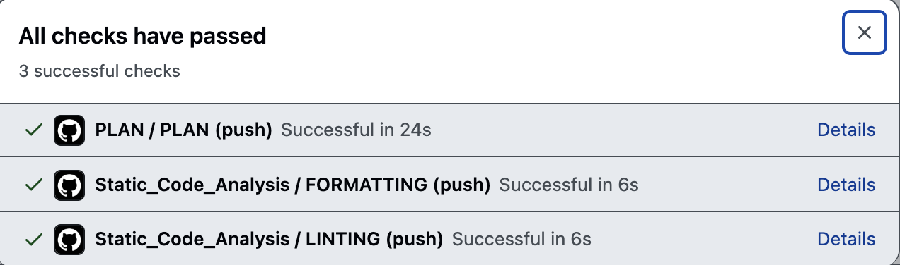

We at [Pixxel](https://www.pixxel.space/) heavily use [Terraform](https://www.terraform.io/) to create, change and destroy infrastructure. Terraform allows you to declare infrastructure as code in a language called HCL. Once you have expressed your IaC in code, you can commit to a version control. You can get it reviewed collaboratively; if things go wrong, you can roll it back. It allows us to move fast, following principles similar to software engineering, including clean code practices. With that said, the following section will provide a basic introduction to Terraform and explain how we use Terraform to democratize infrastructure at Pixxel.

## Typical Terraform Workflow

Terraform allows you to dry-run your changes before actually applying them. This is called a "Plan." The result of running a plan is a human-readable diff of the changes.

Here is the most straightforward Terraform file. It uses the `kreuzwerker/docker` provider to pull an image `nginx:latest` and create a container called `nginx`.

```hcl
# main.tf

terraform {
  required_providers {
    docker = {
      source  = "kreuzwerker/docker"
      version = "3.0.2"
    }
  }
}

provider "docker" {
  host = "unix:///var/run/docker.sock"
}

resource "docker_image" "nginx" {
  name = "nginx:latest"
}

resource "docker_container" "nginx" {
  image = "nginx"
  name  = "psyduck"
  ports {
    internal = 80
    external = 80
  }
}

```

If you run `terraform plan` from the root directory of this file. You get the following output:

```
Terraform used the selected providers to generate the following execution plan. Resource actions are indicated with the following symbols:
  + create

Terraform will perform the following actions:

  # docker_container.nginx will be created
  + resource "docker_container" "nginx" {
      + attach                                      = false
      + bridge                                      = (known after apply)
      + command                                     = (known after apply)
      + container_logs                              = (known after apply)
      + container_read_refresh_timeout_milliseconds = 15000
      + entrypoint                                  = (known after apply)
      + env                                         = (known after apply)
      + exit_code                                   = (known after apply)
      + hostname                                    = (known after apply)
      + id                                          = (known after apply)
      + image                                       = "nginx"
      + init                                        = (known after apply)
      + ipc_mode                                    = (known after apply)
      + log_driver                                  = (known after apply)
      + logs                                        = false
      + must_run                                    = true
      + name                                        = "psyduck"
      + network_data                                = (known after apply)
      + read_only                                   = false
      + remove_volumes                              = true
      + restart                                     = "no"
      + rm                                          = false
      + runtime                                     = (known after apply)
      + security_opts                               = (known after apply)
      + shm_size                                    = (known after apply)
      + start                                       = true
      + stdin_open                                  = false
      + stop_signal                                 = (known after apply)
      + stop_timeout                                = (known after apply)
      + tty                                         = false
      + wait                                        = false
      + wait_timeout                                = 60

      + ports {
          + external = 80
          + internal = 80
          + ip       = "0.0.0.0"
          + protocol = "tcp"
        }
    }

  # docker_image.nginx will be created
  + resource "docker_image" "nginx" {
      + id          = (known after apply)
      + image_id    = (known after apply)
      + name        = "nginx:latest"
      + repo_digest = (known after apply)
    }

Plan: 2 to add, 0 to change, 0 to destroy.

─────────────────────────────────────────────────────────────────────────────────────────────────────────────────────────────────────────────────────

Note: You didn't use the -out option to save this plan, so Terraform can't guarantee to take exactly these actions if you run "terraform apply" now.
```

You can apply the plan by running `terraform apply` if the plan looks good. You will observe the following output:

```
Do you want to perform these actions?
  Terraform will perform the actions described above.
  Only 'yes' will be accepted to approve.

  Enter a value: yes

docker_image.nginx: Creating...
docker_container.nginx: Creating...
docker_image.nginx: Still creating... [10s elapsed]
docker_container.nginx: Still creating... [10s elapsed]
docker_image.nginx: Creation complete after 10s [id=sha256:4b196525bd3cc6aa7a72ba63c6c2ae6d957b57edd603a7070c5e31f8e63c51f9nginx:latest]
docker_container.nginx: Creation complete after 10s [id=cf2b32c1c0c3b3aa53386949fe5ca35b19b753a648e34d582fd35b5f5a858cf1]

Apply complete! Resources: 2 added, 0 changed, 0 destroyed.
```

Terraform stores the current infrastructure state in a "state file" named "terraform.tfstate" extension. When you run the plan, it will show the diff between the current code and the state file. When you accept and apply the diff, Terraform will make the appropriate changes to update the infra and state file. The code and state remain in sync. Terraform uses the [Providers](https://registry.terraform.io/browse/providers) to make the infra changes.

To run Terraform collaboratively, a team of SRE/DevOps engineers may choose to share the same state file with everyone in the team - by putting it in a shared bucket, e.g., an S3 bucket. This way, multiple people making changes to infra will not accidentally overwrite each other. When someone runs a plan/apply action, Terraform acquires a lock on the state file. When others try to access the state, they will see an error ensuring the serializability of infra changes. We can share the state file by mentioning the `backend` block inside the terraform file.

Example:

```hcl
# main.tf

terraform {
  required_providers {
    docker = {
      source  = "kreuzwerker/docker"
      version = "3.0.2"
    }
  }

  backend "s3" {
    bucket = "mybucket"
    key    = "path/to/my/key"
    region = "us-east-2"
  }
}
```

Terraform will try to connect to this bucket and proceed to it using the configured authentication mechanism. In later sections, we will explore authentication in depth.

## Going one step beyond

Even with a collaborative workflow, the responsibility of making infra changes relies solely on individual DevOps/SRE team members. This can be a good or bad thing, depending on how one views it.

It is good because only a particular set of people have to do infrastructure work, giving other developers (such as Backend, ML, and AI engineers) time to focus on their core problems, which are shipping out new features and fixing bugs. It is bad because only a particular set of people can make infrastructure changes 😄, which creates a blocker for other teams, even for the simplest tasks.

Most of the time, the infra changes requested by the developer and other teams are [ops/toil](https://sre.google/sre-book/eliminating-toil/) in nature, such as giving or removing access, increasing disk sizes, creating SSH users on servers, or setting up CI/CD for a new service. Infra teams can set up local automation scripts for such ops tasks. They can even share the scripts with other teammates.

The issue with local runs is that the environment can break easily. For example, provider version mismatch, unintended package updates, corrupted config files, and cloud authentication issues can break local automation environments due to regressions. These issues can also be a problem for Terraform modules. Such regressions can delay resolving these ops requests and lead to X-Y problem scenarios. The Engineer wanted to complete the ops task but found themselves debugging the correct config file values. Situations like these can cause ops fatigue if not appropriately dealt with. Introducing a new member to the team increases the problem many folds. An experienced teammate must personally teach the new member all the "tips" and "tricks" of running Terraform. The complexity of the infrastructure landscape can also add up to more regressions, such as many cloud providers in use and legacy infra code. It just adds up the time to resolve the ops task at hand.

That's where terraform on CI can help.

We can run the terraform automation scripts on a CI pipeline. In that case, we can drastically reduce the average time to resolve ops tasks. Furthermore, developers can get unblocked by contributing to such automation since the code speaks for itself! It saves much time for everyone. Moreover, running Terraform on a CI is just like any other recurring software engineering task that needs to run in an automated way if appropriately designed. In the upcoming section, I will explain how we put Terraform on CI at Pixxel. But let's look at how the terraform workflow stated in the previous section changes. Below are the updated steps:

1. You make the required code changes to the relevant terraform modules.
2. You raise a PR with such changes
3. The CI detects the changed modules against the main branch.
4. The CI runs the Terraform plan on these modules using the same shared state file.
5. Other team members can review the plan. You can also perform static code checks such as linting and formatting.
   

6. If the plan looks good, the PR can be merged.
7. Once the changes are in the main branch, the plan can be applied(automatically or with a manual trigger).

This approach has several benefits. The CI will reliably set up Terraform, its providers, and other supporting packages. It can carry out tasks repeatedly without drifting configurations. Engineers can make multiple infra changes can be made in parallel. It is collaborative, as the logs from the Terraform run are visible to people inside your org. People can review the diff, request changes, and suggest changes quickly.

Moreover, you can roll back reliably. This workflow increases everyone's participation in infrastructure and builds confidence in changes. And let's be honest, solving ops problems all the time is boring and soon becomes frustrating. If you can't avoid it, best automate it. Once you have Terraform running on CI, you can "hopefully" ask dev teams to raise PRs -- for simple ops changes. You can point them to how to do it from similar ops changes done in the past. Of course, this claim that developers will raise Infra PR depends heavily on the engineering culture of the org 😅. But I think it brings hope for collaboration, better than zero visibility into infrastructure by developer teams.

With the intent set, part two of this blog will discuss the technical aspects of setting up Terraform on CI. We will cover Authentication and Authorization with cloud providers, Terraform providers, and CI triggers. Stay tuned!
